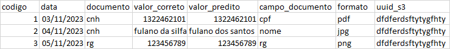

# projeto_swa_jacad
código fonte inicial do projeto de integração com IA

===========================================04/05/2023===============
projeto ocr descomplica, implantação

Acesso ssh (Descomplica-OCR)
User: ocr-user
Pass: rHIw4r0*1rwv
Porta: 1951
Url: descomplica-ocr.jacad.com.br

[comment]: <> (docker image build -t python_project_mock_jacad .)

[comment]: <> (docker run -p 5000:5000 -d python_project_mock_jacad)

[comment]: <> (docker push duvictorsc/python_project_mock_jacad)

[comment]: <> (sudo docker pull duvictorsc/python_project_mock_jacad)

===============================tentativa 2 ==================
na máquina de dev
	docker build -t duvictorsc/python_project_mock_jacad:v1 .
	docker run --name python_project_mock_jacad -p 5000:5000 -d duvictorsc/python_project_mock_jacad:v1

	docker tag duvictorsc/python_project_mock_jacad:v1 duvictorsc/python_project_mock_jacad:v1-release
	docker push duvictorsc/python_project_mock_jacad:v1-release

na máquina de prod
	sudo docker ps
	sudo docker container stop 45a4a8044a71    
	sudo docker rm python_project_mock_jacad
	sudo docker pull duvictorsc/python_project_mock_jacad:v1-release
	sudo docker run --name python_project_mock_jacad -p 5000:5000 -d duvictorsc/python_project_mock_jacad:v1-release
	
	
	
testar no navegador

http://descomplica-ocr.jacad.com.br:5000

Link para os .h5
criar pasta models e fazer download em:
https://drive.google.com/drive/folders/1D8Hhl1RglhsqWzgE810duKcjlHBaFpMf?usp=share_link

#04/11/2023

exemplo de tabela para geração de dashboar para controle de utilização

